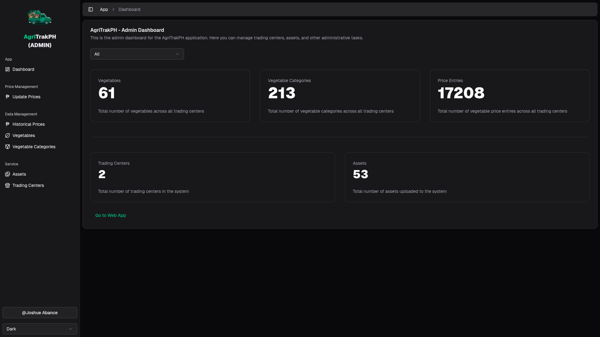
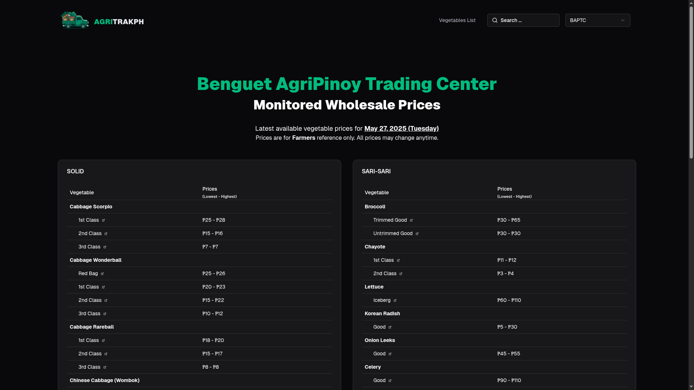

> [!NOTE]
> Logo is subject for change.

# AgriTrakPH [MarketMonitor]

Vegetable price monitoring serice for farmers.

Supported Trading Centers:

- **[BAPTC](https://www.facebook.com/baptc.price)**
- **[NVAT](https://www.facebook.com/NVATerminal/)**

> [!NOTE]
> This project is not official / sponsored.

## Development

This monorepo project both contains the following Next.js services:

#### ADMIN

For project moderation, update prices, images, etc.



During development it should be running in `http://localhost:5555`

##### Required Environment Variables

> Please contact if you want guidance for this section.

```sh
# github oauth
GITHUB_CLIENT_ID=
GITHUB_CLIENT_SECRET=

# postgres db
POSTGRES_PASSWORD=
POSTGRES_USER=
POSTGRES_DB=
POSTGRES_HOST=127.0.0.1
POSTGRES_PORT=5432

# utils
BETTER_AUTH_SECRET=
BETTER_AUTH_URL=
```

#### WEB

Main monitoring web app.



During development it should be running in `http://localhost:5000`

##### Required Environment Variables

```sh
VEGGIES_API=http://localhost:7000 # running instance of https://github.com/Market-Monitor/veggies-api
```

### Monorepo Shared Packages

- **[auth](./packages/auth/)**

  Better auth setup.

- **[ui](./packages/ui/)**

  Shadcn shared components, include also hooks, ui libs, etc.

- **[eslint-config](./packages/eslint-config/)**
- **[typescript-config](./packages/typescript-config/)**

  Development config setups, eslint, prettier, tsconfigs.

- **[internal](./packages/internal/)**

  Internal API fetcher for the [API](https://github.com/Market-Monitor/veggies-api)

### Running

```sh
# Clone repo
git clone https://github.com/Market-Monitor/app.git

cd app

# Install deps
pnpm install

# Run
pnpm dev
```

## Deployment

Use docker compose for deploy.

```sh
docker compose up -d --build
```

This will deploy both `web` and `admin` service.

## TODO

- More improvements
- E2E Tests
